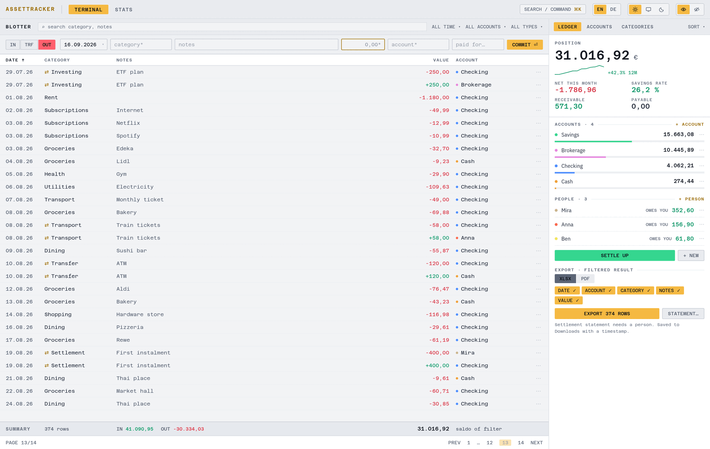
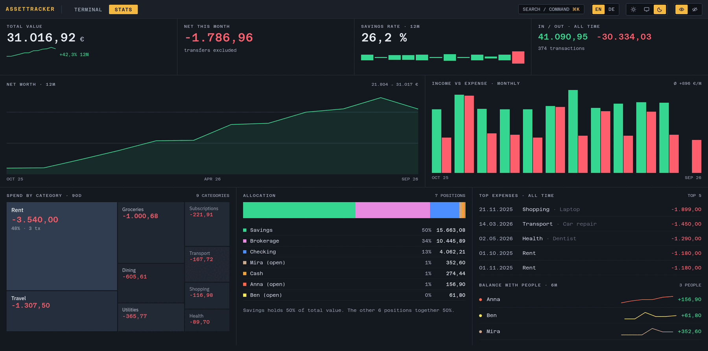
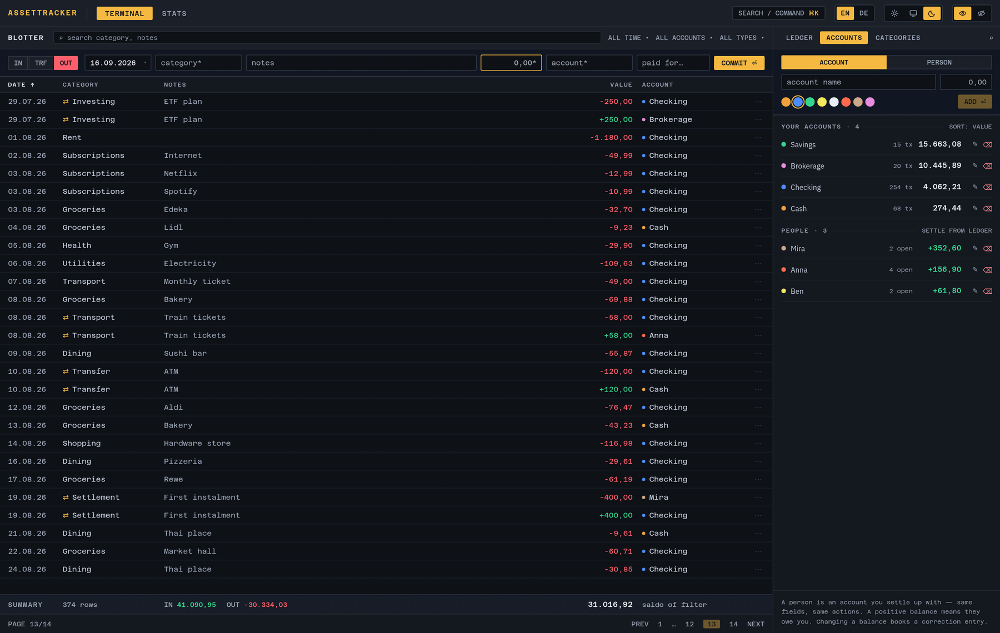
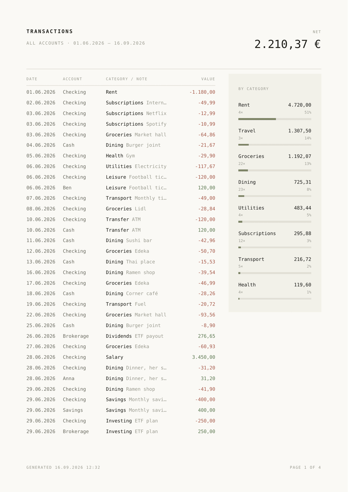

# AssetTracker

A local-first desktop ledger for personal finances. Accounts, transactions, categories, exports and statistics, stored in a single passphrase-encrypted SQLite file on your own machine.

Built with Tauri 2 (Rust) and React. Ships as a Windows installer, a Flatpak and an AppImage.

<picture>
  <source media="(prefers-color-scheme: dark)" srcset="docs/screenshots/ui-terminal-dark.png">
  
</picture>

<sub>The terminal in light and dark. Every screenshot on this page uses invented data.</sub>

## Why AssetTracker

- **Your data stays with you.** Everything lives in one SQLCipher-encrypted database file that you choose the location of. There is no account, no sync, no telemetry and no network access.
- **Fast to use every day.** One terminal screen: a quick-entry strip docked above the transaction blotter, inline editing on every row, a `Ctrl+K` command palette that also parses shorthand like `out 21,50 groceries`, keyboard shortcuts, and a global "mask amounts" toggle for when someone is looking over your shoulder.
- **Built for shared money.** People you lend to, borrow from or pay for get their own balance: positive when they owe you, negative when you owe them. A settlement statement lists what is still open, oldest first.
- **Real exports.** Excel and PDF exports of any filtered view, with the columns you pick, saved straight to your Downloads folder.

## Features

- Accounts with colours and balances computed from transactions, plus "person" accounts for everyone you settle up with.
- Transactions as income, expense or transfer. Transfers are written as a linked pair, and an expense or income can be split with a person in the same step.
- Categories with inline management; new ones can be created straight from the transaction form.
- Server-side search, filtering by account, type and time span, sorting on every column, and pagination that opens on your most recent entries.
- Excel (`.xlsx`) and PDF exports of the current filter, plus a per-person settlement statement with an optional target amount.
- Statistics: net worth over time (total or per account), income vs. expenses, spending and income by category, top expenses, savings rate.
- Light, dark and system theme; mask-amounts toggle; lock-database action; keyboard shortcuts.
- European conventions throughout: `dd.mm.yyyy` dates and `1.234,56 €` amounts.

## Screenshots

**Statistics** — net worth over twelve months, income against expenses, spending by category, the biggest expenses, and the balance with each person.



**Command palette** (`Ctrl` `K`) — go anywhere, settle up with someone, export the current filter, or type a transaction straight in.


**Accounts and people** — balances, transaction counts and open items, managed in the ledger column beside the blotter.



**Exports** — the PDF of a filtered view, in whichever language the app is set to.

[](docs/screenshots/pdf-report-en.png)
## Install

### Windows

Download the `-setup.exe` installer from the [latest release](https://github.com/MacKenzie779/asset-tracker/releases/latest) and run it. WebView2 is installed automatically if missing.

### Linux (Flatpak, recommended)

The Flatpak is served from a repository on GitHub Pages, so it updates with the rest of your Flatpaks.

```bash
flatpak remote-add --user --if-not-exists flathub https://dl.flathub.org/repo/flathub.flatpakrepo
flatpak install --user --from https://mackenzie779.github.io/asset-tracker/AssetTracker.flatpakref
flatpak run com.github.mackenzie779.assettracker
```

Update or remove later with `flatpak update` and `flatpak uninstall com.github.mackenzie779.assettracker`.

### Linux (AppImage)

Download the `.AppImage` from the [latest release](https://github.com/MacKenzie779/asset-tracker/releases/latest), make it executable and run it. AppImages do not update themselves; download a new file for a new version.

## First run

1. Click **Create new database**, choose where the file should live and set a passphrase.
2. Create one or more accounts, optionally with an initial balance.
3. Commit transactions from the quick-entry strip above the blotter (or `Ctrl+K` and type `out 12,50 groceries`).

The passphrase is the encryption key of the database. It is never written to disk and **cannot be recovered**. If you lose it, the data in that file is gone. Keep the passphrase somewhere safe and back up the database file itself; a backup is a copy of the single `.db` file.

You are asked for the passphrase on every launch. Only the path of the last database is remembered.

## Concepts

**Accounts** are your own money: bank accounts, cash, savings. Their balances count towards your total value.

**People** are everyone you settle up with. A person has a balance like an account, with a natural sign: **positive means they owe you, negative means you owe them**. Total value is simply the sum of every balance, so lending money or paying for someone never distorts it.

| Situation | What you record | Anna's balance |
| --- | --- | --- |
| You pay 30 € for Anna | Expense with *Paid for: Anna* (or a transfer Bank → Anna) | owes you 30 € |
| Anna pays you back | Transfer Anna → Bank | settled |
| Anna pays 50 € for your dinner | Expense on account *Anna* | you owe 50 € |
| Shared 100 € dinner you paid, half each | Expense 100 € with *Paid for: Anna*, their share 50 € | owes you 50 € |
| You borrow 1 000 € from a friend | Transfer Friend → Bank | you owe 1 000 € |

An expense booked directly on a person is your consumption paid by them, so it counts in your spending statistics. **Settle up** (`Ctrl+S`, or the button in the ledger column) lists the open items oldest first, lets you pick them or type a target amount, books the settlement as a transfer to one of your accounts, and exports the **settlement statement** with what is still due, in whichever direction the balance points.

**Transfers** move money between any two accounts or people. Both sides are written together and stay linked: editing the date, notes, category or amount of one side updates the other, and deleting one side removes both. A transfer to or from a person keeps the category of the expense it belongs to, so a person's ledger and settlement statement show what each amount was for. Plain moves between your own accounts use the reserved category `Transfer`. An account's initial balance is stored as a real transaction with the reserved category `Init`. Transfers and initial balances are excluded from spending statistics.

### Upgrading from 1.x

Version 2 replaces the old "reimbursable" account type with people. The first time a 1.x database is unlocked, the app copies the file to `<name>.backup-before-0002.db` next to it, then converts it: former reimbursable accounts become people, their balances switch to the natural sign, and the mirrored entries the old version wrote are turned into linked transfers that keep their categories. Nothing is lost, and the backup stays untouched.

## Keyboard shortcuts

| Keys | Action |
| --- | --- |
| `Ctrl` `K` | Command palette: search, actions, and transaction shorthand |
| `Ctrl` `N` | Focus the quick entry |
| `Ctrl` `S` | Settle up with a person |
| `Ctrl` `E` | Export the current filter |
| `Ctrl` `,` | Ledger column → ACCOUNTS tab |
| `Ctrl` `1` / `2` | Terminal / Stats tab |
| `J` `K` or `↑` `↓` | Move the row selection in the blotter |
| `Enter` / `Backspace` | Edit / delete the selected row (delete is undoable) |
| `Ctrl` `Z` | Undo the last commit or delete |
| `/` | Focus the blotter search |
| `H` | Mask or show all amounts |
| `Ctrl` `Shift` `L` | Lock the database and return to the unlock screen |
| `?` | Show the shortcut list |
| `Enter` / `Esc` | Save or cancel an inline edit |
| `Tab` | Accept a completion in the quick entry or the palette |

On macOS builds `Ctrl` is `⌘`.

## Data and privacy

- The database is a SQLite file encrypted with SQLCipher. The passphrase is applied as the cipher key when the file is opened and lives only in memory.
- The app makes no network requests. The content security policy blocks remote origins, and the Rust side has no HTTP client.
- Besides the database, the app keeps a few preferences in the webview's local storage: the last database path, the theme, the mask-amounts state, the last used transaction type and account, the export format and columns, and the account sort. No financial data is stored there.
- Exports are written to your Downloads folder with a timestamped name and are not encrypted.

## Building from source

Prerequisites: Node.js 20+, a stable Rust toolchain, and the Tauri 2 system dependencies for your platform. On Debian and Ubuntu:

```bash
sudo apt-get install -y libwebkit2gtk-4.1-dev libgtk-3-dev libayatana-appindicator3-dev librsvg2-dev patchelf
```

On Windows, install [NSIS](https://nsis.sourceforge.io/) if you want to build the installer. SQLCipher and OpenSSL are compiled into the binary, so no system SQLCipher is required.

```bash
npm install
npm run tauri:dev     # development build with hot reload
npm run tauri:build   # release bundles for the current platform
```

The `tauri:*` scripts wrap the Tauri CLI and inject the current Git tag as the application version. Checkouts that are not on a tag report a `-dev` version.

Useful commands while developing:

```bash
npm run build                     # type-check and build the frontend only
./node_modules/.bin/tsc --noEmit  # type-check only
```

## Releases

Pushing a tag of the form `vX.Y.Z` triggers three GitHub Actions workflows:

| Workflow | Output |
| --- | --- |
| `release-windows` | NSIS installer attached to the GitHub release |
| `release-linux-appimage` | AppImage attached to the GitHub release |
| `release-linux-flatpak` | Flatpak built on the GNOME runtime, published to the OSTree repository on GitHub Pages |

The version in `package.json` is bumped from the tag during the build and is not committed.

## Project layout

```
src/                     React frontend (Vite, TypeScript, Tailwind)
  pages/                 Terminal (blotter + ledger column), Stats, Login
  components/terminal/   Blotter, quick entry, ledger tabs, command palette, settle sheet, controls
  components/            Shell layout, modal, toasts, icons
  styles/terminal.css    Design tokens (dark is the designed theme; light inverts the surfaces) and component classes
  lib/                   Typed wrappers around Tauri commands, in-memory ledger store, analytics, settlement, formatting, theme, shortcuts
  hooks/                 Small React hooks
src-tauri/
  src/main.rs            All Tauri commands: database, accounts, transactions, categories, search, exports
  migrations/            sqlx migrations applied when a database is opened
  tauri.conf.json        Window, bundle and plugin configuration
.github/workflows/       Release pipelines
```

Notes for contributors:

- Database migrations are checksummed by sqlx. Never edit an existing migration; add a new numbered file instead. Before a migration runs on an existing file the app copies it to a backup next to it.
- `cargo test` in `src-tauri` runs the migration tests against a scratch database seeded with 1.x data.
- Balances are never stored; they are always the sum of an account's transactions.
- The frontend never talks to SQLite directly. Every data access goes through a command in `main.rs` and its wrapper in `src/lib/api.ts`.

## Tech stack

Tauri 2 · Rust · sqlx with bundled SQLCipher · React 18 · TypeScript · Vite · Tailwind CSS · IBM Plex Sans and Azeret Mono (bundled) · rust_xlsxwriter · printpdf

## Contributing

Bug reports and pull requests are welcome. For larger changes, open an issue first to discuss the approach. Please keep pull requests focused and make sure `npm run build` passes before submitting.
